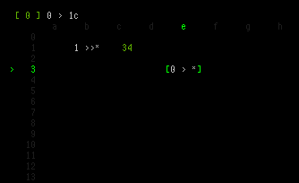

isc - intiger spreadsheet calculator
====================================
simple intiger based spreadsheet calculator




Insalation
----------
edit config.h to change color and number of columns (changes the way 
spreadsheets are allocated and read from files (note: number of rows
changes automatically on terminal resize).

to install run (as root if necessary):

	make instal


Running isc
-----------
isc takes just one command like argument, it is the file name
(if no filename is given isc writes into out.isc). example:

	isc mysc.csv


Using isc
---------
isc uses vim bindings to move the cursor.
`hjkl`  movement (20j moves 20 rows down)
`w`  write to file
`q`  quit
`>`  isert text
`=`  store result of expression in current cell
`Enter`  parses the text in the current box as an expression, or
         sets curent box to the modifier number

Commands
--------
C-like syntax: `1 + 4,   (4 + 3) * 22`.
Cells can be accessed as row, column: `20f`.
Result of operations can be "piped" into another cell
with `>`: `4a + 20 > 2b`.
You can also specify execution of cells command:
``` c
0a >! 0a   pipe value to a2 and execute it's command
1a >& 1a   execute if is nonzero
2a >| 2a   execute if is zero
1  >> a    add result to a

0b ;  0b   don't pipe value, only execute command
1b ;& 1b   only execute if nonzero
2b ;| 2b   only execute if zero

3a >? 3a : 3c   pipe and execute command a3 if nonzero, otherwise execute c3
3b ;? 3b : 3c   only execute command b3 if nonzero, otherwise execute c3
```
NOTE: `>& ; >|` always pipe the value, only execution is conditional


File format
-----------
.csv format, where numbers and strings can occupy the same cell
```
1563,55,1"hello", # comment
8645,30,0"world","!",
```
